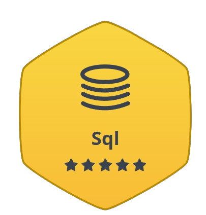
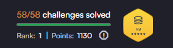

## Hi there 👋

### 👋 Hi, I'm Hyeok Jun  
Data Analyst who turns data into insight & impact.  

---

## 🧠 About Me
- 🎓 Double major in **Administration & Economics** 
- 📊 Experienced in **data analysis projects** (RFM, Cohort, GA, Tableau)  
- 🤝 Skilled at **PM & collaboration** with Notion / JIRA  
- 🌱 Currently expanding to **data engineering & full-stack basics** (SSAFY 14기)  

---

## 🛠 Tech Stacks

**Languages**  
  
  

**Data & Visualization**  

  

**Tools**  

  

---

## 🏅 Algorithm Badges

<!-- 해커랭크 캡쳐 이미지 -->

<!-- 해커랭크 캡쳐 이미지 -->

<!-- 해커랭크 텍스트 뱃지 -->

&nbsp;&nbsp;

---

## 💼 Projects
- **AI Quiz Service (2025)**: PM – 최신 기사 기반 자동 퀴즈 서비스 로드맵 관리  
- **Customer Loyalty Analysis**: RFM 세분화 + GA 분석 → 재구매율 개선 전략 제안  
- **Airline Recommendation Dashboard**: 가격·지연율 종합 평가지표 + Tableau 시각화  
- **Music Chart Analysis (17 years)**: 크롤링 데이터셋 구축 → 장르 트렌드 분석  

---

## 📊 GitHub Stats

