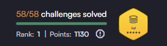

## 👋 Hyeok Jun  
**Data Analyst focused on structure, flow, and decision impact**

---

## 🧠 About Me
- 📊 Analyze user behavior & revenue structure to support real business decisions  
- 🧩 Design decision frameworks beyond simple dashboards  
- 🏗 Understand data pipelines & service architecture (SSAFY Data Track)  
- 🎓 Double major in Administration & Economics (Statistics & Econometrics)

---

## 🛠 Tech Stacks

### 📊 Analysis

### 🏗 Data & Engineering

### 🤝 Collaboration & Tools

---

## 💼 Projects

### 🔹 Customer Loyalty Analysis (Real Business Data)
- RFM segmentation & revenue structure diagnosis  
- Re-purchase simulation & executive presentation  

### 🔹 GOR – Context-based Recommendation Service
- Real-time & batch data architecture  
- Weight-based recommendation logic + chatbot input  
- Kafka / Spark / Elasticsearch integration  

### 🔹 Large-scale E-commerce Log Analysis
- 20M+ row SQL processing  
- Behavior flow reconstruction & domain inference  

### 🔹 Airline Recommendation Dashboard
- Multi-metric scoring framework  
- Interactive Tableau decision dashboard  

### 🔹 Music Chart Trend Analysis (17 Years)
- Selenium-based data crawling  
- Long-term vs short-term trend interpretation  

### 🔹 AI Quiz Service (PM)
- Article → AI → Quiz → Log data flow design  
- GitHub OAuth & Docker environment setup  

### 🔹 Eggit – GitHub Activity Automation
- GitHub data → automated blog generation  
- FastAPI, React, Docker, EC2  

### 🔹 LAYOUTNEMO – Visual Task Manager
- Canvas-based task visualization tool  
- Front-end implementation & deployment
  
---

## 🏅 Badges

---

## 📈 Currently Exploring
- End-to-end decision pipeline design  
- Data-driven product thinking  
- Scalable data architecture

