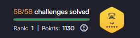

# 권혁준

데이터로 업무의 문제를 확인하고, 필요한 도구를 만들어 실제 운영에 적용합니다.

대학 취업지원부서에서 상담사업의 참여 현황 관리, 수당 정산, 결과보고를 담당하고 있습니다. 반복적인 자료 수집과 대조에는 AI 코딩 도구를 활용하며, 업무 기준을 정하고 결과를 원자료와 비교하는 일은 직접 합니다.

## Selected projects

### [LAYOUTNEMO](https://github.com/Yuwolx/LAYOUTNEMO)

생각과 업무를 카드로 배치하고 관계를 연결하는 시각적 작업 공간입니다. 업무를 목록으로만 관리할 때 맥락과 연결 관계를 놓치는 문제에서 출발했습니다.

- 역할: 서비스 기획, 화면 설계, AI 코딩 도구를 활용한 제작과 검증
- 기술: TypeScript, React
- [서비스 보기](https://v0-layout-ui-concept.vercel.app)

### [기상 합의 · 앙상블 날씨](https://github.com/Yuwolx/weather-ensemble)

여러 예보 모델의 값을 한 화면에서 비교하고, 예보의 차이를 확률 분포로 보여 주는 날씨 대시보드입니다.

- 역할: 문제 정의, 정보 구조와 화면 설계, AI 코딩 도구를 활용한 제작과 검증
- 기술: JavaScript, Open-Meteo API, PWA
- [서비스 보기](https://yuwolx.github.io/weather-ensemble/)

### [Plys](https://github.com/Yuwolx/Plys)

음악과 영상을 여러 출처에서 수집해 플레이리스트와 앨범 커버를 만드는 팀 프로젝트입니다.

- 역할: 데이터 수집·정제, 출처별 식별자 연결, AI·데이터 파트 리딩
- 결과: 곡 약 45,450건과 영상 약 42,729건을 연결해 서비스 데이터로 제공
- 기술: Python, TypeScript, Last.fm API, YouTube API

## How I work

- 사용자의 행동과 업무 기록에서 문제를 찾습니다.
- AI가 작성한 코드는 원자료와 예상 사례로 검증합니다.
- 반복 작업을 줄인 시간은 예외 판단과 결과 확인에 사용합니다.
- 실제로 운영할 수 있는지까지 확인한 뒤 작업을 마칩니다.

## Other analysis and service projects

- Customer Loyalty Analysis: RFM 고객 세분화, 재구매 시뮬레이션, 기업 발표
- GOR: 실시간·배치 데이터 구조와 가중치 기반 한강공원 추천
- Large-scale E-commerce Log Analysis: 2,000만 건 행동 로그 분석과 도메인 추론
- Airline Recommendation Dashboard: 가격·지연율·운항횟수 기반 맞춤 추천 대시보드
- Music Chart Trend Analysis: 17개년 차트 수집과 장·단기 추세 분석
- AI Quiz Service: 기사에서 퀴즈와 학습 기록으로 이어지는 서비스 기획
- Eggit: GitHub 활동을 개발 기록으로 바꾸는 서비스 기획·배포

## Tech stacks

### Analysis

### Data & Engineering

### Collaboration & Tools

## SQL practice and credentials

- SQLD 취득
- 프로그래머스 SQL 전 레벨 106제와 LeetCode 28제를 포함해 SQL·Python 문제 130제 이상 풀이
- [문제풀이 저장소](https://github.com/Yuwolx/Yuwol-python_SQL-problem)

## Currently exploring

- End-to-end decision pipeline design
- Data-driven product thinking
- Scalable data architecture
